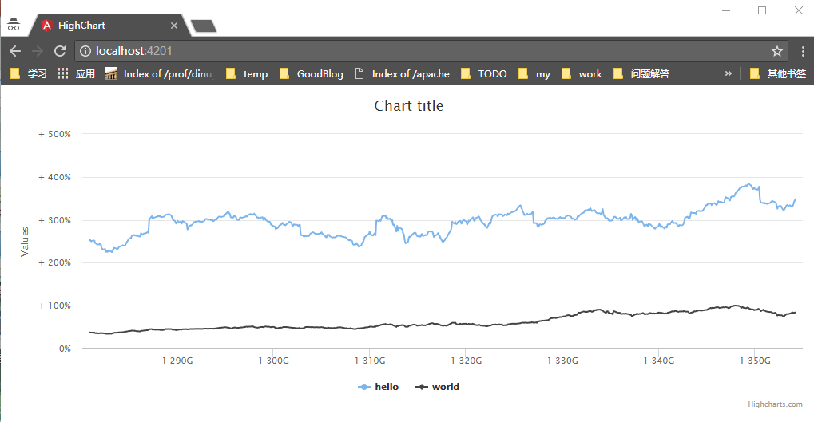

# Using non-Typescript libraries

> Check this -> **[3rd Party Library Installation](https://github.com/angular/angular-cli/wiki/stories-third-party-lib)**

## import the library

`npm install the-third-lib --save`

using **[typings](https://github.com/typings/typings)** to deal with Intellisense and type checking

## reference the library

```js
import * as $ from 'jquery';
import * as something from 'the-third-lib';
```

then use it: 

```
$("#someId").addClass("stacked");
```

## De-referencing Globals - for get rid of compilation errors

`declare var $:any;`

in any Typescript class/component where you want to use these libraries

## My using case - highcharts

1. create a angular project with [angular-cli](https://github.com/angular/angular-cli)

`ng new highchartDemo`

2. import highchart library

`npm i --save highcharts`

after that:

`typings install highcharts --save`

3. use highchart

```typescript
import {Component, OnInit} from '@angular/core';
import * as Highcharts from 'highcharts';

@Component({
  selector: 'app-root',
  templateUrl: './app.component.html',
  styleUrls: ['./app.component.css']
})
export class AppComponent implements OnInit {

  ngOnInit() {
    Highcharts.chart('container', {
      rangeSelector: {
        selected: 4
      },
      yAxis: {
        labels: {
          formatter: function() {
            return (this.value > 0 ? ' + ' : '') + this.value + '%';
          }
        },
        plotLines: [{
          value: 0,
          width: 2,
          color: 'silver'
        }]
      },
      plotOptions: {
        series: {
          compare: 'percent',
          showInNavigator: true
        }
      },
      tooltip: {
        pointFormat: '<span style="color:{series.color}">{series.name}</span>: <b>{point.y}</b> ({point.change}%)<br/>',
        valueDecimals: 2,
        split: true
      },
      series: [{
        name: 'hello',
        data: [
          [1280880000000, 252.91],
            ... // demo data from original demo https://www.highcharts.com/stock/demo/compare
          [1354233600000, 348.84]]
      }, {
        name: 'world',
        data: [
          [1280880000000, 37.57],
            ... // demo data from original demo https://www.highcharts.com/stock/demo/compare
          [1354233600000, 83.61]]
      }]
    });
  }
}
```

```html
<div id="container"></div>
```

## Demo screen shot


