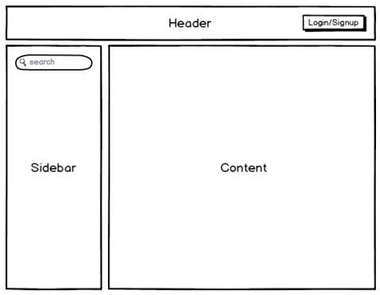
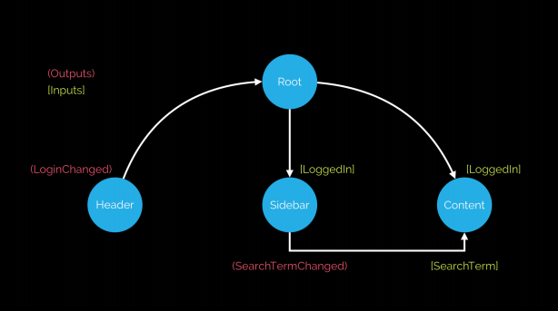

# Angular 学习之旅

## Architecting with Component

在新建 Angular 应用的时候：

1. 将应用划分成**组件（Component）**
2. 描述每个组件的**责任（responsibilities）**
3. 描述每个组件的**inputs** 和 **outputs** 以及公共接口

### Demo

#### HeaderComponent

* Responsibilities
> 各个方面的authentication， 让用户 login/signup 以及 logout
* Inputs
> 无
* Outputs
> * **LoginChanged** 当用户的 login 状态改变时出发的 output 事件

#### SidebarComponent

* Responsibilities
> 执行搜索动作
* Inputs
> 无
* Outputs
> * **SearchTermChanged** 当用户执行 search 后触发的 output 事件， **$event** 包含了搜索细节。

#### ContentComponent

* Responsibilities
> 展示搜索结果
* Inputs
> **SearchTerm** 搜索细节
* Outputs
> 无

### Data Flow

