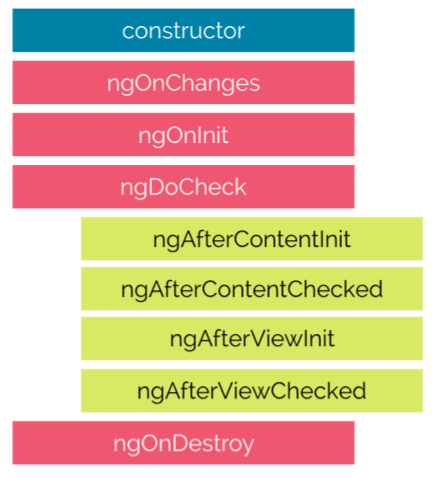

# Angular 学习之旅

## Architecting with Component

在新建 Angular 应用的时候：

1. 将应用划分成**组件（Component）**
2. 描述每个组件的**责任（responsibilities）**
3. 描述每个组件的**inputs** 和 **outputs** 以及公共接口

### Demo


#### HeaderComponent

* Responsibilities
> 各个方面的authentication， 让用户 login/signup 以及 logout
* Inputs
> 无
* Outputs
> * **LoginChanged** 当用户的 login 状态改变时出发的 output 事件

#### SidebarComponent

* Responsibilities
> 执行搜索动作
* Inputs
> 无
* Outputs
> * **SearchTermChanged** 当用户执行 search 后触发的 output 事件， **$event** 包含了搜索细节。

#### ContentComponent

* Responsibilities
> 展示搜索结果
* Inputs
> **SearchTerm** 搜索细节
* Outputs
> 无

### Data Flow


## Content projection

### tagName

```angular
<child *ngFor="let c of childs" [child]="c">
    <span>{{ child.name }}</span>
    <h1>{{ child.desc }}</h1>
</child>
```

```angular
<ng-content select="span"></ng-content>
<ng-content select="h1"></ng-content>
```

* `<ng-content select="span"></ng-content>` will match `<span>{{ child.name }}</span>`
* `<ng-content select="h1"></ng-content>` will match `<h1>{{ child.desc }}</h1>`

### className [better way]

```angular
<child *ngFor="let c of childs" [child]="c">
    <span class="name">{{ child.name }}</span>
    <h1 class="desc">{{ child.desc }}</h1>
</child>
```

```angular
<ng-content select=".name"></ng-content>
<ng-content select=".desc"></ng-content>
```

* `<ng-content select=".name"></ng-content>` will match `<span class="name">{{ child.name }}</span>`
* `<ng-content select=".desc"></ng-content>` will match `<h1 class="desc">{{ child.desc }}</h1>`

## Lifecycle Hooks



* constructor - Invoked when Angular creates a component or directive by calling **new** on the class
* ngOnChanges - Invoked **every** time there is a change in one of the **input** properties of the component
* ngOnInit - Invoked when given component has been initialized. Called **once** after the first **ngOnChanges**
* ngDoCheck - Invoked when the change detector of given component is invoked. We could implement our own change detection algorithm for the given component
* ngOnDestroy - Invoked just before Angular destroys the component. Use this hook to **unsubscribe observables** and **detach event handlers to avoid memory leaks**
* ngAfterContentInit - Invoked after Angular performs any **content projection** into components view
* ngAfterContentChecked - Invoked **each time** the content of given component has been checked by  the change detection mechanism of Angular
* ngAfterViewInit - Invoked when component's view has been fully initialized
* ngAfterViewChecked - Invoked **each time** the view of given component has been checked by the change detection mechanism of Angular

> NOTE: **ngDoCheck** and **ngOnChanges** should not be implemented together on the same component. **ngAfterContentInit ngAfterContentChecked ngAfterViewInit ngAfterViewChecked** are only called for component and not directives.

## ViewChildren & ContentChildren

```angular
<h4 #header>View Jokes</h4>
<br>
<app-joke *ngFor="let j of jokes" [data]="j">
  <span class="setup">{{ j.setup }}?</span>
  <h1 class="punchline">{{ j.punchline }}</h1>
</app-joke>
<hr>
<h4>Content Jokes</h4>
<br>
<ng-content></ng-content>
```

> 以数据来源区分：来自自身Component 来自上一层Component

## Directives

> Components are directives with a view

使用 attribute selectors 将 directives 关联到已存在的 components：

`<element aDirective></element>`

```ANGUALR
constructor(private el: ElementRef, private renderer)
```

## HostListener & HostBinding

@HostListener This is a function decorator that accepts an event name as an argument. When that event gets fired on the host element it calls the associated function.

```angular
  constructor(private el: ElementRef, private renderer: Renderer) {
    //  renderer.setElementStyle(el.nativeElement, 'backgroundColor', 'gray');
  }

  @HostListener('mouseover') onMouseOver() {
    let part = this.el.nativeElement.querySelector('.card-text');
    this.renderer.setElementStyle(part, 'display', 'block');
  }

  @HostListener('mouseout') onMouseOut() {
    let part = this.el.nativeElement.querySelector('.card-text');
    this.renderer.setElementStyle(part, 'display', 'none');
  }
```

As well as listening to **output events** from the host element a directive can also bind to **input properties** in the host element with @HostBinding. This directive can change the properties of the host element, such as the list of classes that are set on the host element as well as a number of other properties. Using the @HostBinding decorator a directive can link an internal property to an input property on the host element. So if the internal property changed the input property on the host element would also change.

```angular
  @HostBinding('class.card-outline-primary') private isHovering: boolean;

  constructor(private el: ElementRef, private renderer: Renderer) {
    //  renderer.setElementStyle(el.nativeElement, 'backgroundColor', 'gray');
  }

  onMouseOver() {
    this.isHovering = true;
  }

  onMouseOut() {
    this.isHovering = false;
  }
```

## Reactive Programming with RxJS

### Stream & Reactive Programming

> Streams are a sequence of values over time.

> Reactive programming is the idea that you can create your entire program just by defining the different streams and the operations that are performed on those streams.

### Observable and how it related to RxJS


### Write reactive code using pure RxJS


### Operators and Marble Diagrams


### Where to use reactive programming in Angular


## Pipes

`{{ 1234.56 | currency : 'USD' }}`

1234.56  => $123,4.56


## Forms

> template driven & model driven

### Model Driven Forms

> define a form model on component and link it to existing HTML form controls 

## Observable

### map

### switch

<code>switch</code> expects a stream of <code>Observables</code>, when it get an <code>Observable</code> pushed onto it’s input stream it unsubscribes from any previous <code>Observables</code> and subscribes to the new one and then emits any values from that <code>Observable</code> onto it’s output stream.

Using <code>switch</code> with <code>map</code> is such a common occurrence that there is a combined operator called <code>switchMap</code>

## JSONP

* 1. Treat API as a javascript file.
* 2. The API wraps the JSON response in a function who’s name we define.
* 3. When the browser downloads the fake API script it runs it, it calls the function passing it the JSON data.

## Routing

> **State** is a computer science terms and means "all the stored information, at a given instant in time, to which program has access".

### Router Guards

> 403 is a HTTP error code specifically this one means Permission Denied

* **CanActivate** - Checks to see if a user can visit a route.
* **CanActivateChild** - Checks to see if a user can visit a routes children.
* **CanDeactivate** - Checks to see if a user can exit a route.
* **Resolve** - Performs route data retrieval before route activation.
* **CanLoad** - Checks to see if a user can route to a module that lazy loaded.

